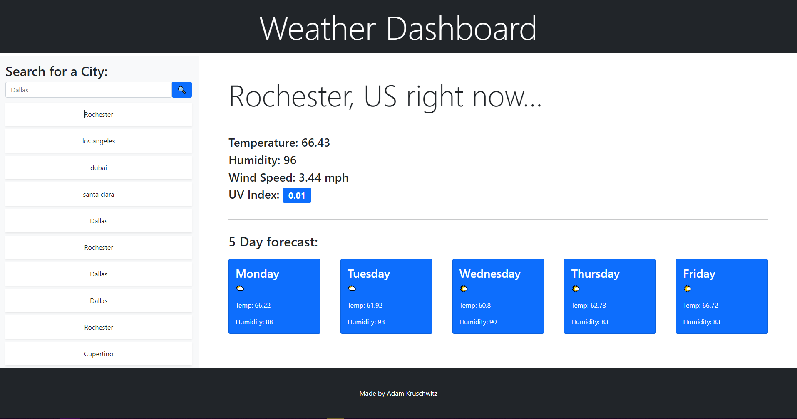

# Weather Dashboard

A weather searching page that stores search history locally. This project was built using bootstrap, jquery, and moment.js along with the OpenWeather OneCall and Geocoding API's.

## Built With

* [HTML](https://developer.mozilla.org/en-US/docs/Web/HTML)
* [CSS](https://developer.mozilla.org/en-US/docs/Web/CSS)
* [Javascript](https://developer.mozilla.org/en-US/docs/Web/JavaScript)
* [Bootstrap](https://getbootstrap.com/)
* [JQuery](https://jquery.com/)
* [Moment.js](https://momentjs.com/)
* [OpenWeather](https://openweathermap.org/)

## Deployed Link

* [See Live Site](https://adamkruschwitz.github.io/weather-dashboard/)

## Screenshot

## Authors

* **YOUR NAME** 

- [Link to Portfolio Site](#)
- [Link to Github](https://github.com/AdamKruschwitz)
- [Link to LinkedIn](https://www.linkedin.com/in/adamkruschwitz/)

See also the list of [contributors](https://github.com/your/project/contributors) who participated in this project.

## License

This project is licensed under the MIT License 